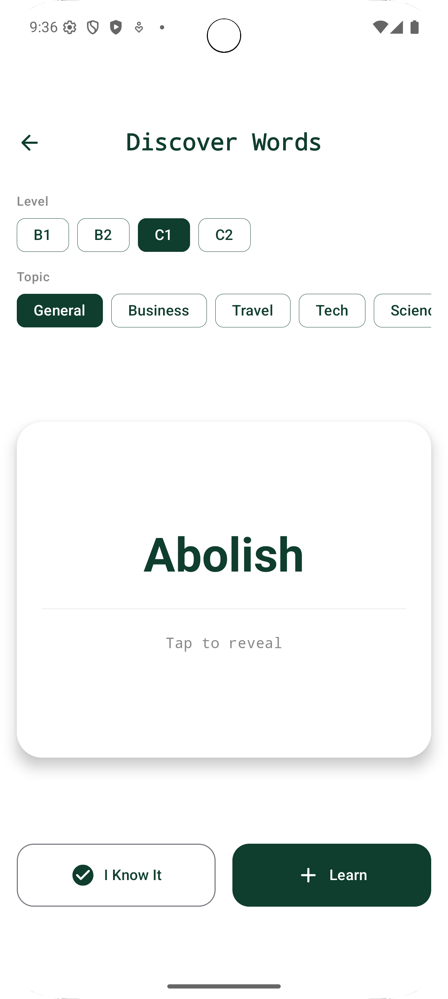
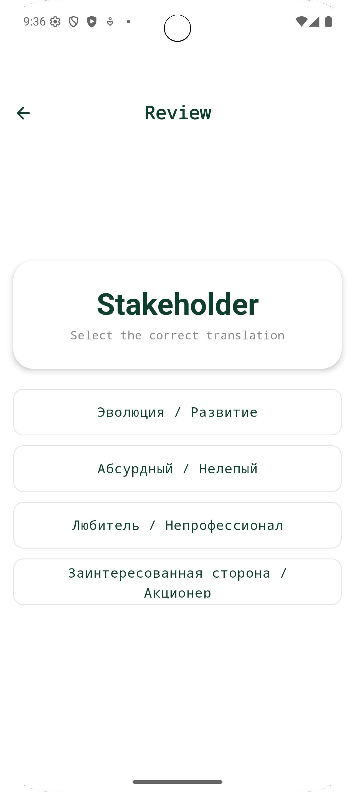
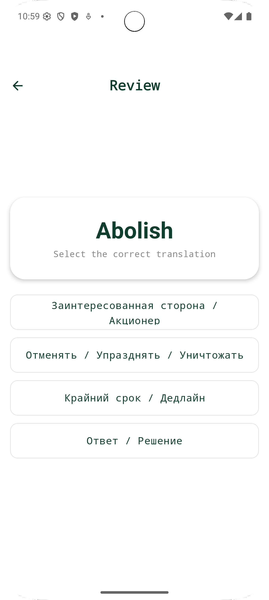
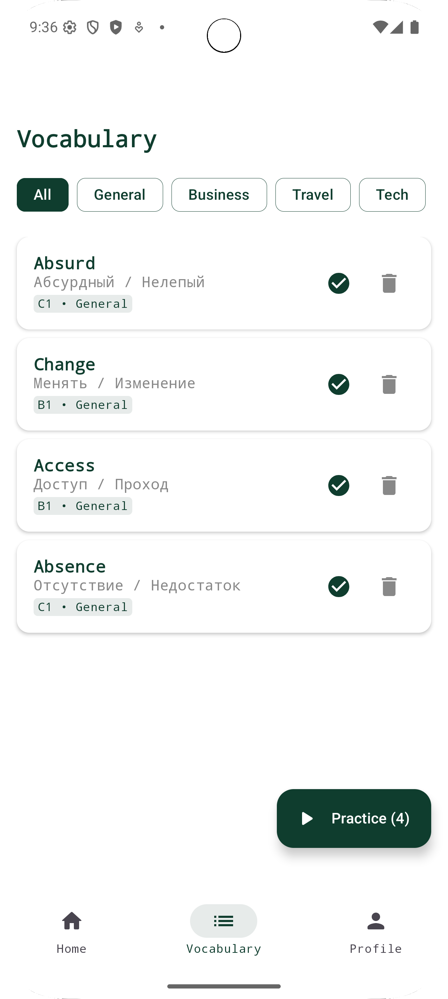
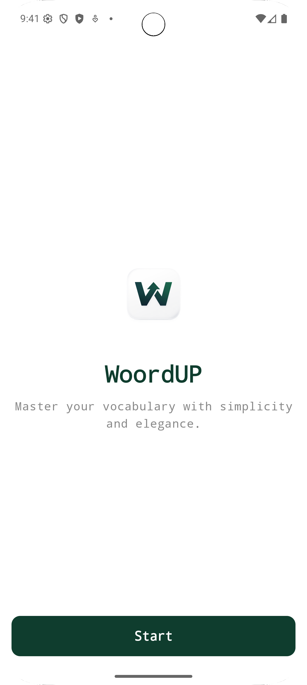

# WoordUP 📱

**WoordUP** is a modern, elegant Android application designed to help Russian speakers master English vocabulary. Focusing on B1 to C2 levels, it offers a curated discovery experience and a reinforcing quiz mode.

## ✨ Key Features

### 1. 🚀 Discovery Mode
Find new words tailored to your proficiency level (B1, B2, C1, C2) and interests (General, Business, Tech, Travel, etc.).


### 2. 🧠 Smart Review System
Test your knowledge with interactive quizzes.
- **Multiple Choice:** Select the correct Russian translation for an English word.
- **Immediate Feedback:** Visual cues for correct/incorrect answers.
- **Progress Tracking:** Words are marked as "Known" only after you successfully recall them.



### 3. 📚 Vocabulary Management
Keep track of your growing vocabulary in a dedicated list. Filter by category and review your progress.


### 4. 🏠 Dashboard & Daily Goals
Stay motivated with a daily goal tracker. Visual progress rings help you maintain your learning streak.


### 5. 👋 Elegant Onboarding
A smooth welcome experience to get you started immediately.


## 🛠 Tech Stack

- **Language:** [Kotlin](https://kotlinlang.org/)
- **UI Framework:** [Jetpack Compose](https://developer.android.com/jetpack/compose) (Material 3)
- **Backend:** [Firebase Firestore](https://firebase.google.com/docs/firestore) & [Firebase Auth](https://firebase.google.com/docs/auth)
- **Networking:** [Retrofit](https://square.github.io/retrofit/) (Integration with [Dictionary API](https://dictionaryapi.dev/))
- **Architecture:** MVVM (Model-View-ViewModel)

## 🚀 Getting Started

### Prerequisites
- Android Studio Iguana or later
- JDK 17
- An Android device or emulator (API Level 26+)

### Installation

1. **Clone the repository**
   ```bash
   git clone https://github.com/duesenbek/woordup.git
   ```

2. **Open in Android Studio**
   - Provide `google-services.json` in the `app/` directory (Required for Firebase).

3. **Sync Gradle**
   - Let Android Studio download dependencies.

4. **Run the App**
   - Select your device and click **Run**.


### made by Duisenbek Bekzat,Asaubaev Kuanysh,Agabekuly Asylbek
#### Native Mobile Developement course
#### Astana IT University 2026  